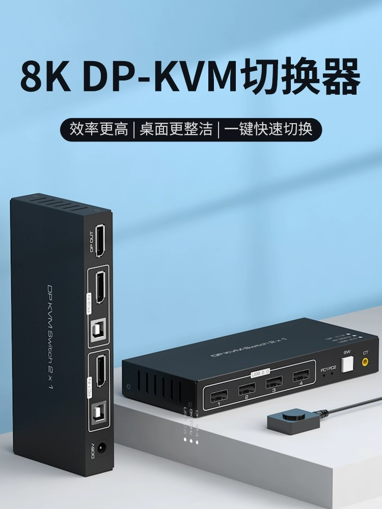
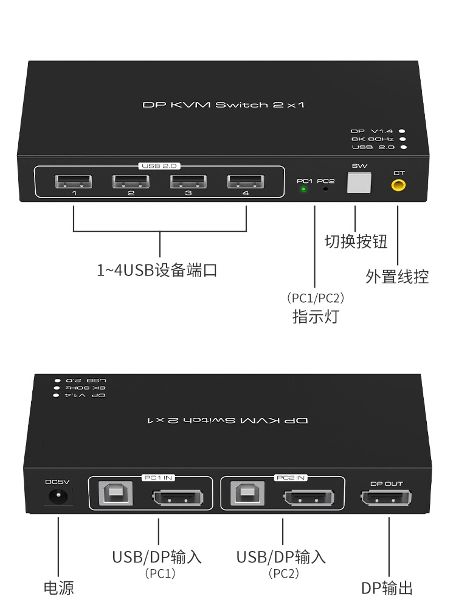

许多家里同时拥有 windows 电脑和 mac 电脑的朋友可能和我有一样的烦恼，mac 用于学习、win 用于游戏，两台设备如果连接两套键鼠，未免太浪费，而手动切换实在麻烦。

目前连接 PC 的设备主要有以下几个：

- 键盘「USB/蓝牙」
- 鼠标「USB/蓝牙」
- 音响「USB/蓝牙」
- 显示器「DP 接口」

理论上说，如果想让 Mac 连接外设只需要手动更换下显示器的 DP 线就可以了，但事实上对我来说蓝牙基本不使用，导致 4 个设备都需要手动插拔更换。

> 关于蓝牙的题外话：我之所以弃用蓝牙主要是两个方面：1. 书桌蓝牙设备太多，经常会莫名断开；2. 蓝牙设备需要充电，我又经常会忘记充电，导致经常在打游戏的过程中，通过设备的迟钝反应才发现需要充电，所以干脆全部都有线连接。

### KVM 的使用场景

如果需要让两台设备使用同一套外设，实现一键切换，最简单的思路就是引入第三个设备作为代理，代理设备对于外设而言是一台电脑，对于电脑而言，代理设备只是一套外设。

而这个代理设备我选用的就是 KVM 切换器。

KVM 切换器整体的接口分为 3  类：

1. 输入接口
2. 输出接口
3. 供电接口

### 使用体验

实际使用起来，KVM 确实很大程度上方便了两台电脑的切换，可以说是无缝衔接。

当然还是有一些小问题存在的

1. 外设的供电是 KVM ，在关机之后，鼠标、键盘和音响都是通电的，晚上关灯之后也是可以看到电源指示灯亮着。
2. KVM 由于连接了太多设备，很多的接线显得十分凌乱，也无法收纳起来

整体来说值得入手，尤其是对于有多台电脑一套外设的朋友而言，KVM 可算得上是必备。

**推荐指数**：🌟🌟🌟🌟

